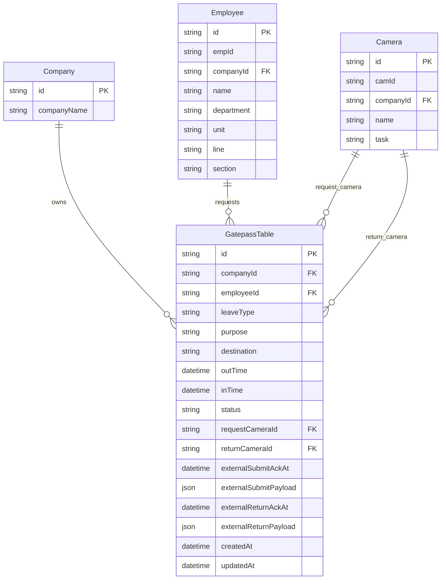

# GatepassTable Schema (Company Scoped)

## Field Rules
- `companyId` is required and enforces strict company-level separation.
- `employeeId` is required and must belong to the same company.
- `leaveType` is required (`short` or `long`).
- `purpose` is required.
- `destination` is optional.
- `outTime` is always stored on submit.
- `inTime` is null until return recognition for short leave.
- `status` is `out` initially and moves to `returned` when `inTime` is set.

## Workflow
1. Create request:
- `short`: insert row only (no final external API call).
- `long`: insert row and run demo final API call immediately.

2. Return recognition:
- For recognized employee, find latest open `short` row (`status=out`, `inTime=null`).
- Set `inTime`, set `status=returned`, and run demo final API call.
